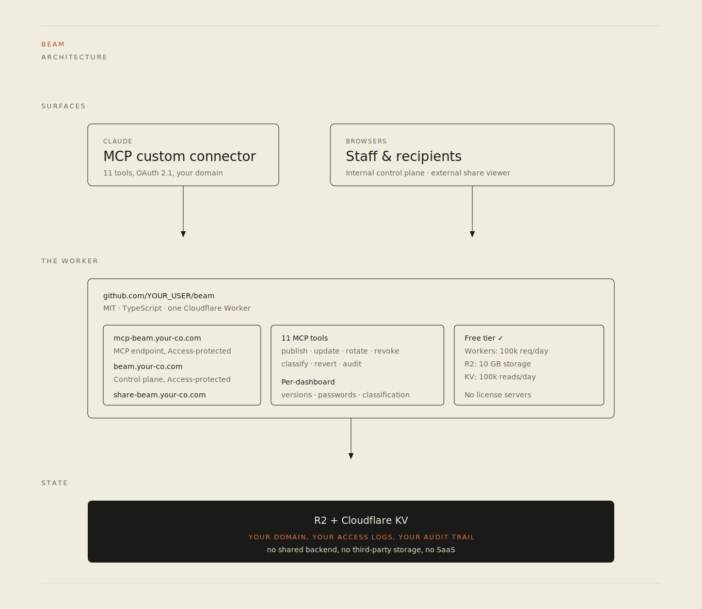
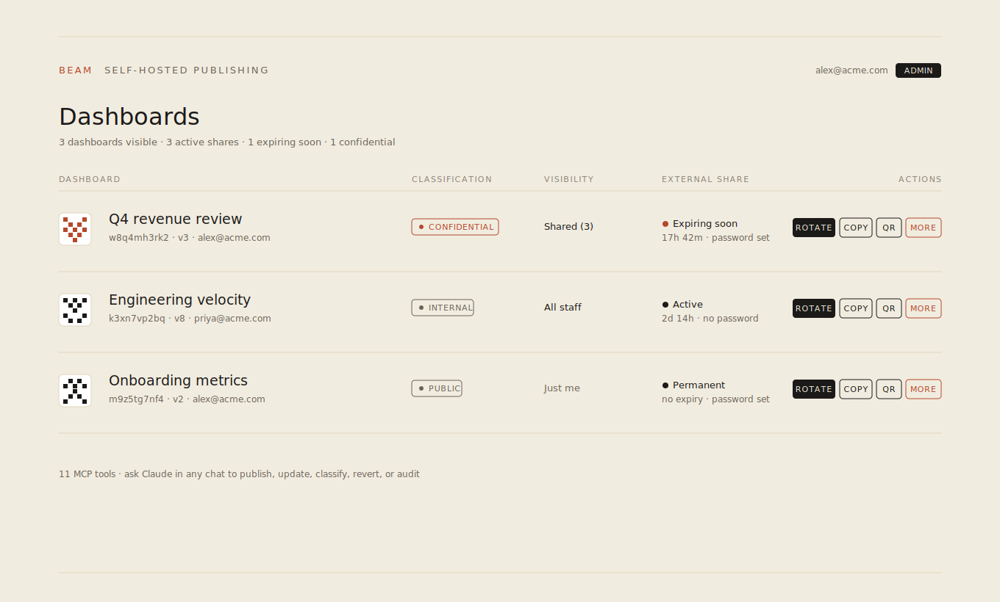

# Beam

**Self-hosted publishing for Claude-generated HTML.** Runs on Cloudflare's free tier. Your domain, your SSO, your audit log.

<p align="center">
  
</p>

[](https://deploy.workers.cloudflare.com/?url=https://github.com/manihagh/beam)

> Replace `YOUR_USER` in the deploy button with your fork.

## What this is

When someone in your Claude org asks Claude to build a dashboard, a report, a calculator, or any other self-contained HTML, Claude generates the HTML inline. The question that always comes next is: where do we put it so people can actually use it?

Today on Claude Team and Enterprise plans, the answer is "internal-only sharing within Claude". You cannot publish externally from claude.ai on those plans. You also cannot publish on your own domain, with your own SSO, with your own audit trail.

Beam closes that gap. It is a small Cloudflare Worker that exposes an MCP connector to Claude. When the user says "publish", Claude calls Beam, and Beam returns two URLs:

- An internal URL on `beam.your-company.com`, behind your SSO.
- An external share URL on `share-beam.your-company.com/{token}` with an auto-generated password and a default 72-hour expiry.

Both URLs serve the same HTML, with a classification banner injected at the top, a privacy footer at the bottom, and an audit log recording every change.

<p align="center">
  
</p>

## What this is not

- Not a SaaS. Beam runs on your Cloudflare account; you operate it.
- Not a BI tool. Claude generates the HTML; Beam hosts it. Data plumbing is your problem.
- Not a multi-tenant platform. One Beam deployment serves one org. Each adopting company runs their own.
- Not officially supported. See [MAINTENANCE.md](MAINTENANCE.md) for what to expect.

## Why Cloudflare's free tier is enough

Workers, R2, KV, and Cloudflare Access all have free tiers that allow commercial use at meaningful scale.

- **Workers free tier:** 100,000 requests per day per account. A typical Beam deployment uses well under 1,000.
- **R2 free tier:** 10 GB storage, 1 million Class A operations per month. Dashboards average tens of KB; you would need 100,000 dashboards to get close.
- **KV free tier:** 100,000 reads, 1,000 writes per day. Each publish is a handful of writes.
- **Cloudflare Access free tier:** up to 50 users on Cloudflare Zero Trust Free.

If you hit any of these limits, you have grown well past "side project" and should be on a paid plan anyway.

## Architecture

Three custom domains, one Worker, one R2 bucket, one KV namespace.

```
mcp-beam.your-company.com   Cloudflare Access in front. MCP endpoint that
                            Claude calls to publish, update, list, delete,
                            and manage dashboards.

beam.your-company.com       Cloudflare Access in front. Internal control plane:
                            lists all dashboards, lets staff copy share links,
                            rotate, revoke, set classification, view versions,
                            view audit log, delete.

share-beam.your-company.com      No Access. Public viewer. Each path is a share
                            token. Tokens expire automatically (KV TTL) and
                            can be revoked manually. If the dashboard has a
                            password, the recipient sees a password prompt.
```

For a more detailed view, see [docs/architecture.md](docs/architecture.md). For the security model, see [docs/threat-model.md](docs/threat-model.md).

## Tools exposed to Claude

11 MCP tools:

- `publish_dashboard(html, title, share_duration_hours?, classification?)`
- `update_dashboard(uuid, html)`
- `list_dashboards()`
- `delete_dashboard(uuid)`
- `rotate_share_link(uuid, share_duration_hours?)`
- `revoke_share_links(uuid)`
- `set_visibility(uuid, mode, emails?)` modes: `private`, `shared`, `org`
- `regenerate_password(uuid)`
- `set_classification(uuid, classification)` values: `public`, `internal`, `confidential`
- `list_versions(uuid)`
- `revert_dashboard(uuid, version)`
- `get_audit_log(uuid, limit?)`

## Quick start

1. Fork this repo, or clone it.
2. Copy the wrangler config and fill in your values:
   ```bash
   cp wrangler.example.toml wrangler.toml
   ```
   Edit `wrangler.toml`:
   - Replace `YOUR_COMPANY.com` in the three `routes` and three host vars with your domain.
   - Set `ALLOWED_SSO_DOMAINS` to the email domains your staff use.
   - Set `ADMIN_EMAILS` to the people who can issue permanent share links and override owner-only mutations.
   - Set `BRAND_NAME`, `BRAND_PRIMARY_COLOR`, `BRAND_FROM_EMAIL` to taste.
3. Authenticate to Cloudflare and deploy:
   ```bash
   npx wrangler login
   ./deploy.sh
   ```
   The script creates the R2 bucket, KV namespace, sets the MCP bearer token, and deploys the Worker.
4. In the Cloudflare dashboard, set up SSO via **Cloudflare Access**. This takes two Self-hosted apps and one Managed OAuth toggle. Step-by-step:

   a. **Zero Trust > Access > Applications > Add an application > Self-hosted.** Create the **control plane** app:
      - Subdomain: `beam`, Domain: `your-company.com`
      - Identity providers: pick whatever your org uses (Google Workspace, Microsoft Entra, Okta, GitHub, or "One-Time PIN" for solo testing)
      - Policy: Allow > Emails ending in > your `ALLOWED_SSO_DOMAINS` value

   b. **Repeat** for the MCP host: subdomain `mcp-beam`, same identity providers, same policy. Name it "Beam MCP" or similar.

   c. **Open the MCP app's settings > Additional settings > OAuth.** Toggle **Managed OAuth** to ON (currently in Beta on Cloudflare's side). Configure:
      - Allow localhost clients: ON
      - Allow loopback clients: ON
      - Allowed redirect URIs: `https://claude.ai/api/mcp/auth_callback`
      - Grant session duration: Same as session duration
      - Access token lifetime: Default

   d. Do **not** create an Access app for `share-beam.your-company.com`. That host is intentionally public, gated only by share tokens and passwords.

5. In Claude, go to **Settings > Connectors > Add custom connector**:
   - Name: `Beam`
   - URL: `https://mcp-beam.your-company.com/mcp`
   - Leave OAuth fields empty. Cloudflare's Managed OAuth handles the discovery flow on the connector's first request.

   The first time anyone uses Beam in a chat, Claude opens a browser tab to authenticate via your SSO. After that, the connector is live for that user until the grant session expires.

6. Install the publishing skill so Claude knows when and how to use Beam's tools:
   - Open `claude.ai/customize/skills` (Settings > Capabilities > Skills on some clients).
   - Click **Add skill** (or **Create skill**).
   - Paste the contents of `skill/publishing/SKILL.md` from this repo, or upload the file directly.
   - Save.

   On Team and Enterprise plans, an org admin does this once for everyone. On Pro/Free, it is a per-account install.

That is the whole setup. Total time, around 15 minutes including Cloudflare Access policy setup.

## Local development

```bash
npm install
echo 'MCP_BEARER_TOKEN=dev-test-token' > .dev.vars
npm run dev
```

In local dev, all three hostnames collapse onto `localhost:8787`. The Worker routes by path (`/mcp`, `/api/...`, `/share/{token}`, `/{uuid}`).

Smoke tests:

```bash
# List tools
curl -s -X POST http://localhost:8787/mcp \
  -H "Authorization: Bearer dev-test-token" \
  -H "Content-Type: application/json" \
  -d '{"jsonrpc":"2.0","id":1,"method":"tools/list"}' | jq

# Publish a tiny dashboard
curl -s -X POST http://localhost:8787/mcp \
  -H "Authorization: Bearer dev-test-token" \
  -H "Content-Type: application/json" \
  -d '{
    "jsonrpc":"2.0","id":2,"method":"tools/call",
    "params":{
      "name":"publish_dashboard",
      "arguments":{
        "html":"<!DOCTYPE html><html><head><meta charset=\"utf-8\"><meta name=\"viewport\" content=\"width=device-width,initial-scale=1\"></head><body style=\"font:16px/1.5 system-ui;padding:40px\"><h1>Hello</h1></body></html>",
        "title":"Smoke",
        "share_duration_hours":1
      }
    }
  }'
```

A sample dashboard you can publish to test layout is at [examples/sample-dashboard.html](examples/sample-dashboard.html).

## Configuration reference

Everything is env-var driven. See [docs/configuration.md](docs/configuration.md) for the full list with defaults and what each one does.

## Documentation

- [docs/architecture.md](docs/architecture.md): how the pieces fit together, request flow, storage layout.
- [docs/configuration.md](docs/configuration.md): every env var, what it does, and the defaults.
- [docs/threat-model.md](docs/threat-model.md): the security posture, who Beam defends against, what is out of scope.
- [SECURITY.md](SECURITY.md): security posture, scope, and self-host responsibilities.
- [MAINTENANCE.md](MAINTENANCE.md): what you can and cannot expect from the maintainers.
- [CONTRIBUTING.md](CONTRIBUTING.md): how to file issues and PRs that get merged.

## Why no API token

A long-lived Cloudflare API token with the scopes Beam needs (Workers, R2, KV, DNS, Workers Routes) is broad enough that an exfiltrated token could change DNS for an entire zone. Using `wrangler login` instead means:

- Authentication is browser-based OAuth tied to your Cloudflare identity.
- The session expires (default 30 days) and is revocable.
- Nothing sensitive sits in env vars, scripts, or shell history.

The only runtime credential in production is whatever Cloudflare Access issues to the user as part of the OAuth-based connector flow. The MCP bearer token in `.mcp-token` is used only for local dev and as a defense-in-depth fallback if Access is ever misconfigured. Rotate it by deleting `.mcp-token` and re-running `deploy.sh`.

## File layout

```
.
├── README.md              this file
├── LICENSE                MIT
├── SECURITY.md            security posture
├── MAINTENANCE.md         expectations
├── CONTRIBUTING.md        PR / issue guidance
├── package.json
├── tsconfig.json
├── wrangler.example.toml  copy to wrangler.toml and fill in
├── deploy.sh              idempotent deploy via wrangler login
├── docs/                  architecture, configuration, threat model
├── examples/              sample-dashboard.html, smoke-test.sh
├── skill/
│   └── publishing/
│       └── SKILL.md       installable in any Claude org
└── src/
    ├── index.ts           router (hostname + path)
    ├── config.ts          env-driven configuration
    ├── store.ts           R2 + KV layer with audit, versioning, classification
    ├── mcp.ts             JSON-RPC server, 11 tools
    ├── api.ts             internal control plane API
    ├── serve.ts           internal /{uuid} serving
    ├── share.ts           public /{token} viewer + password challenge
    ├── landing.ts         internal control plane UI
    ├── tracking.ts        view logging + classification banner injection
    ├── track-api.ts       /track/heartbeat and /track/leave endpoints
    ├── email.ts           Gmail API send (optional)
    ├── email-queue.ts     orchestration
    ├── email-template.ts  HTML email templates (Inter, fingerprint header)
    ├── fingerprint.ts     deterministic SVG glyph per uuid
    └── qr.ts              QR generation
```

## License

MIT. See [LICENSE](LICENSE).
